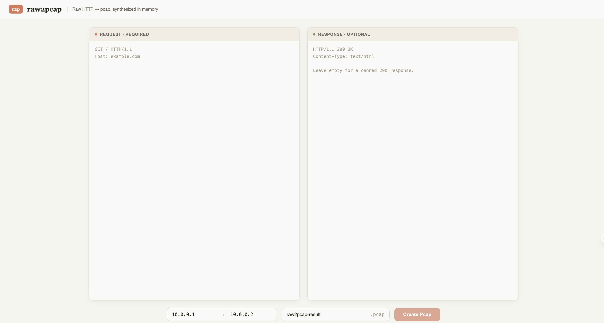

# raw2pcap

[English](README.md) | **简体中文**

**仅支持 HTTP/1.x。** raw2pcap 根据原始 HTTP/1.x 请求/响应文本生成 pcap 文件。粘贴（或传入）一个原始 HTTP 请求和可选的响应，它会在内存中合成一条完整的 TCP 会话——三次握手、按 MSS 分段并逐段确认、四次挥手、校验和全部有效——因此生成的抓包在 Wireshark 的 TCP 重组、Follow Stream 和校验和验证下表现得像真实流量。

## 安装

需要 Python 3.10+（uv 会在缺少时自动安装托管的 Python）。

**方式 A —— uv（推荐新手）。** 先安装 uv：

```bash
# macOS（Homebrew）
brew install uv
# 或任意 macOS/Linux 终端
curl -LsSf https://astral.sh/uv/install.sh | sh
# Windows（PowerShell）
powershell -ExecutionPolicy ByPass -c "irm https://astral.sh/uv/install.ps1 | iex"
```

然后在源码目录中：

```bash
uv sync
uv run raw2pcap serve          # 无需手动激活虚拟环境
```

**方式 B —— pip + 虚拟环境。** 新版 Python 会拒绝向系统 Python 安装包（PEP 668），因此请始终使用虚拟环境：

```bash
python3 -m venv .venv
source .venv/bin/activate      # Windows: .venv\Scripts\activate
pip install .
raw2pcap serve
```

如果提示 `raw2pcap: command not found`，说明包尚未安装或虚拟环境未激活——使用方式 A 的 `uv run raw2pcap ...`，或按方式 B 激活虚拟环境。

## 使用方法

以下命令假设包已安装（虚拟环境已激活）。使用 uv 管理环境时，请在命令前加 `uv run`——例如 `uv run raw2pcap serve`。

### Web UI

```bash
raw2pcap serve
```

在 http://127.0.0.1:5000 启动 Web 界面。`serve` 默认绑定 `127.0.0.1`，且 API 没有身份认证，因此请保持 localhost 访问，除非你自行添加保护（见[安全](#安全)）。

如果 5000 端口已被占用——macOS 上"隔空播放接收器"经常占着它——改用 `raw2pcap serve --port 5001`。

打开页面，粘贴请求（必填）和响应（可选，留空时使用内置的 `200 OK`，响应体为 `generated by raw2pcap`），可选地设置会话中使用的 Client IP / Server IP（Client 默认 `10.0.0.1`；Server IP 留空时取 Host 头中的字面 IPv4，`127.0.0.1` 除外，否则用默认 `10.0.0.2`），选择文件名，下载 pcap。



同样的端点也支持编程方式调用：

```bash
curl -o out.pcap -F 'inputRequest=@request.txt' -F 'inputResponse=@response.txt' \
  -F 'clientIp=192.168.1.100' -F 'serverIp=192.168.1.10' \
  http://localhost:5000/api/pcap
```

`inputRequest` / `inputResponse` 既可以是普通文本字段，也可以是文件（如上）；`clientIp` 可选（默认 `10.0.0.1`）；`serverIp` 留空时取 Host 头中的字面 IPv4（`127.0.0.1` 除外）；Host 为域名或 `127.0.0.1` 时使用默认 `10.0.0.2`。

### CLI

```bash
raw2pcap generate request.txt [response.txt] -o out.pcap
```

可用 `--client-ip` / `--server-ip` 自定义会话中的地址（Client 默认 `10.0.0.1`；不传 `--server-ip` 时，若 Host 为字面 IPv4（`127.0.0.1` 除外）则取其值，否则用默认 `10.0.0.2`）：

```bash
raw2pcap generate request.txt response.txt -o out.pcap \
  --client-ip 192.168.1.100 --server-ip 192.168.1.10
```

## 定位：不适合批量生成

**raw2pcap 面向一次性、交互式的抓包合成——请勿将 Web API 用于批量生成 pcap。** 如果需要大量 pcap，请编写脚本驱动 CLI（或直接调用 `raw2pcap.generate.generate_pcap`）。

原因：

- 报文合成是纯 Python 的 CPU 密集型工作。Web API 在线程中运行它，而线程受 GIL 串行化，因此并发请求不会加快速度——只会一起变慢。
- HTTP 层本身是防御性的，而非可扩展的：请求体超过 256 KiB 会被拒绝（413），并且只允许 3 个并发连接（其余排队）。
- Docker 容器预期在严格的资源限制下运行（`--memory 512m --cpus 1 --pids-limit 100`）。

## 质量保证

- **输入校验**（`validate.py`）：格式错误的输入以 400 拒绝——例如 HTTP/1.1 请求缺少 `Host`、头/体分隔行以空白开头、过时的折叠头、`Host` 端口超出 1–65535、`Content-Length` 非数字或重复，以及任何 `Transfer-Encoding: chunked` 报文（不支持解码 chunked 体；请粘贴解码后的主体并配合 `Content-Length`）。可疑但合法的输入（单个 Content-Length 与主体长度不符）会产生警告，通过 `X-Raw2pcap-Warnings` 响应头返回。
- **输出自检**（`selfcheck.py`）：每个生成的 pcap 都会立即重新解析并验证——重新计算校验和、检查序列号是否有间隙/重叠、重组后的载荷与 HTTP 报文逐字节比对。失败意味着合成器存在 bug，返回 500。

## 逼真度说明

这些抓包是*刻意合成的*，训练有素的眼睛一眼就能看出来：没有 TCP options（SACK、时间戳、MSS 协商），窗口大小固定（64240），ISN 固定（1000/5000），包间延迟是机械的 0.1ms。会话是"完美"的——没有重传、没有抖动——真实流量永远不会这样。这适合 IDS 规则测试、解析器开发和教学；不要指望这些 pcap 在仔细检查下能冒充真实抓取流量。会话仅基于 IPv4 合成；不支持 IPv6。

## 配置

部署期配置项，通过环境变量设置（启动时读取一次）：

| 变量 | 默认值 | 作用 |
|---|---|---|
| `RAW2PCAP_MAX_BODY_BYTES` | `262144`（256 KiB） | API 接受的最大请求+响应大小（超过返回 413） |
| `RAW2PCAP_LIMIT_CONCURRENCY` | `3` | uvicorn 允许的并发连接数；其余排队 |
| `RAW2PCAP_MSS` | `1460` | 将载荷拆分到数据包时使用的 TCP 段大小 |

## 安全

Web API **没有身份认证**。在 256 KiB 上限下，每个请求大约消耗 2.3 秒 CPU，且最多同时处理 3 个请求——任何能访问该端点的人都可以让所有 CPU 核心持续忙碌。

`raw2pcap serve` 默认绑定 `127.0.0.1`——请保持这样，**不要将服务暴露到不可信网络**。如果必须对外提供访问，请放在带身份认证的反向代理后面，并强制执行资源限制（下面的 Docker 命令使用了 `--memory 512m --cpus 1 --pids-limit 100`）。

## 开发

```bash
uv sync
uv run pytest              # 测试
uv run ruff check .        # lint
```

Docker：

```bash
docker build -t raw2pcap:latest .
docker run -d -p 5000:5000 --memory 512m --cpus 1 --pids-limit 100 \
  --restart unless-stopped raw2pcap:latest
```

如果宿主机 5000 端口已被占用——macOS 上"隔空播放接收器"经常占着它，访问会返回 `AirTunes` 的 403——换一个宿主端口即可：

```bash
docker run -d -p 5001:5000 --memory 512m --cpus 1 --pids-limit 100 \
  --restart unless-stopped raw2pcap:latest
```

## 许可证

MIT——见 [LICENSE](LICENSE)。
